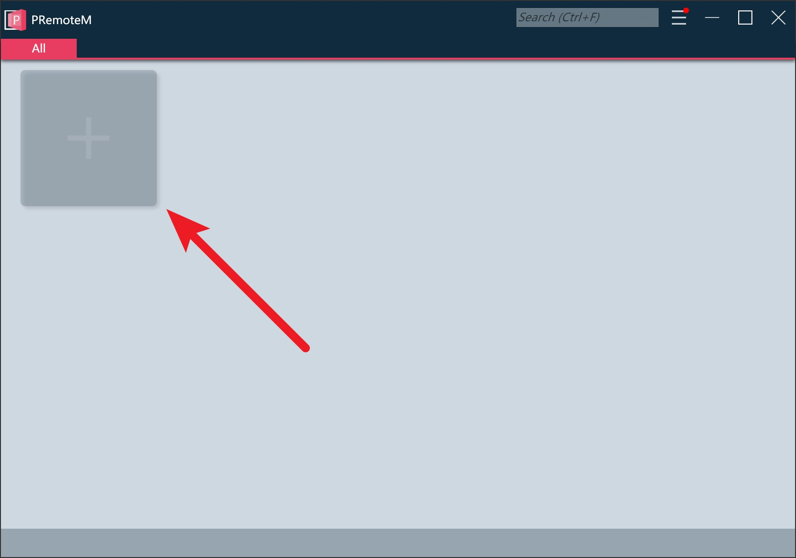

# Quick Start

## 项目背景
    CONV-19疫情爆发以后，本人不得不在家远程办公。但本人家里的配置是双显示器，一直使用的 mRemoteNG 并不支持 RDP 多屏幕远程，而使用 MSTSC.exe 在会话的启动、切换上又有诸多不爽，于是以此为契机开始打算造个自己满意的 windows 平台远程管理工具，最终就诞生了本项目。
---
    PRemoteM = Personal Remote Manager

## 重要特性
 - 基于 Tab 页的远程窗体管理
 - 支持 RDP 多屏幕远程
 - 支持 SSH、Telnet
 - 支持HiDPI、UI缩放以及分辨率感知（要求被远程方为 Win10/Win2016 以上系统）
 - [支持快速启动远程会话](/快速启动远程会话.md)
 - [多端同步实践]()
 - [从mRemoteNG快速迁移](/数据迁移实践.md)

## 安装

1. 确认已安装 .Net framework 4.8 环境。 [环境安装包下载](https://dotnet.microsoft.com/download/dotnet-framework/net48)
2. 可通过以下任一方式安装软件包
   1. 绿色版 Portable package
   2. Windows Store

## 使用
完整说明： [链接](htt)
1. 主页面点击 + 按钮添加服务器远程参数。
   
   
2. 双击服务器卡片启动远程会话。
   
    
3. <kbd>Alt</kbd>+<kbd>M</kbd>启动快速搜索，输入关键字并<kbd>Enter</kbd>启动远程会话。
    
4. 在<kbd>设置</kbd>→<kbd>常规</kbd>中设置语言、程序自启动、最小化启动等。
5. 在<kbd>设置</kbd>→<kbd>快速启动</kbd>中设置快速启动的快捷键。
6. 在<kbd>设置</kbd>→<kbd>数据与安全</kbd>中设置数据库加密。

## 卸载
1. 软件设置中查看数据库路径，删除或迁移数据库，若进行了加密，请妥善处理好自己的私钥
2. 软件设置中打开日志文件所在文件夹，或直接打开 %LOCALAPPDATA%\PRemoteM 将其删除
3. 删除 PRemoteM.exe 所在的文件夹

## 参与贡献
- <kbd>翻译</kbd>：你可将 安装目录下 Languages 文件夹内的 en-us.json 复制一份，并以新的语言名称命名（[ISO 639-1](https://en.wikipedia.org/wiki/List_of_ISO_639-1_codes)），然后用文本编辑器打开该文件，并将其中的英文文本翻译成新的语言。修改完成后，打开 PRemoteM 即可在设置中将界面设置为新的语言。
- <kbd>测试</kbd>：使用过程中遇到的任何 BUG 或不友好的体验都可以在 [Issues](https://github.com/VShawn/PRemoteM/issues) 中提出。
- <kbd>捐赠</kbd>：